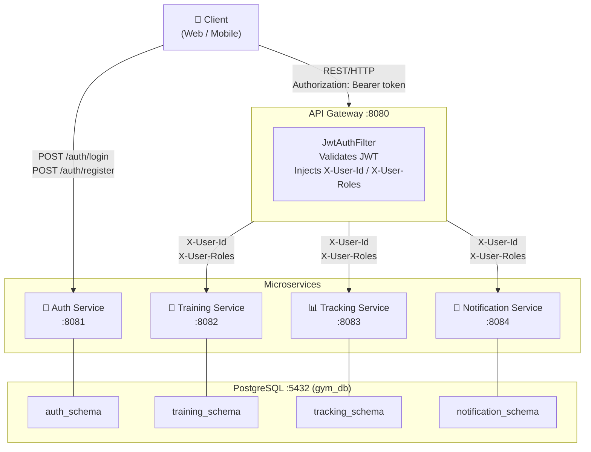
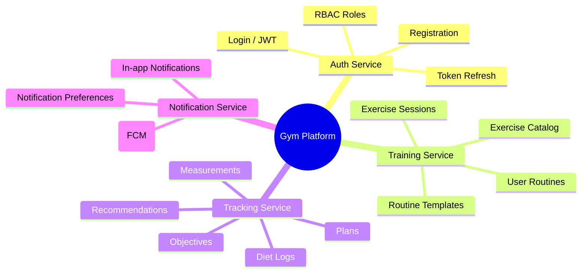

# System Architecture Diagram

## High-Level Architecture

```mermaid
graph TB
    Client["📱 Client\n(Web / Mobile)"]

    subgraph Gateway["API Gateway :8080"]
        JwtFilter["JwtAuthFilter\nValidates JWT\nInjects X-User-Id / X-User-Roles"]
    end

    subgraph Services["Microservices"]
        Auth["🔐 Auth Service\n:8081"]
        Training["🏃 Training Service\n:8082"]
        Tracking["📊 Tracking Service\n:8083"]
        Notification["🔔 Notification Service\n:8084"]
    end

    subgraph DB["PostgreSQL :5432 (gym_db)"]
        AuthSchema["auth_schema"]
        TrainingSchema["training_schema"]
        TrackingSchema["tracking_schema"]
        NotifSchema["notification_schema"]
    end

    Client -->|"REST/HTTP\nAuthorization: Bearer token"| Gateway
    Client -->|"POST /auth/login\nPOST /auth/register"| Auth

    Gateway -->|"X-User-Id\nX-User-Roles"| Training
    Gateway -->|"X-User-Id\nX-User-Roles"| Tracking
    Gateway -->|"X-User-Id\nX-User-Roles"| Notification

    Auth --- AuthSchema
    Training --- TrainingSchema
    Tracking --- TrackingSchema
    Notification --- NotifSchema
```

## Service Responsibilities

```mermaid
mindmap
  root((Gym Platform))
    Auth Service
      Registration
      Login / JWT
      Token Refresh
      RBAC Roles
    Training Service
      Exercise Catalog
      Routine Templates
      User Routines
      Exercise Sessions
    Tracking Service
      Measurements
      Objectives
      Plans
      Diet Logs
      Recommendations
    Notification Service
      In-app Notifications
      Push Tokens (FCM)
      Notification Preferences
```
