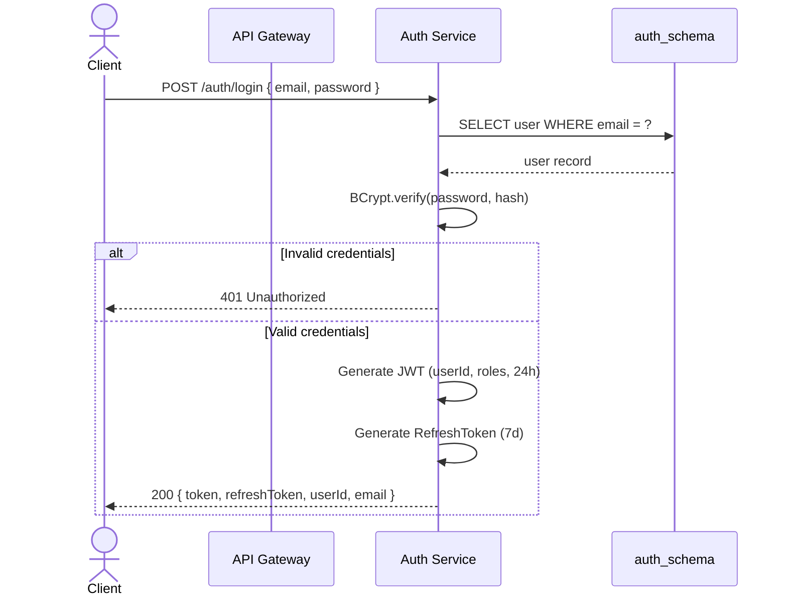
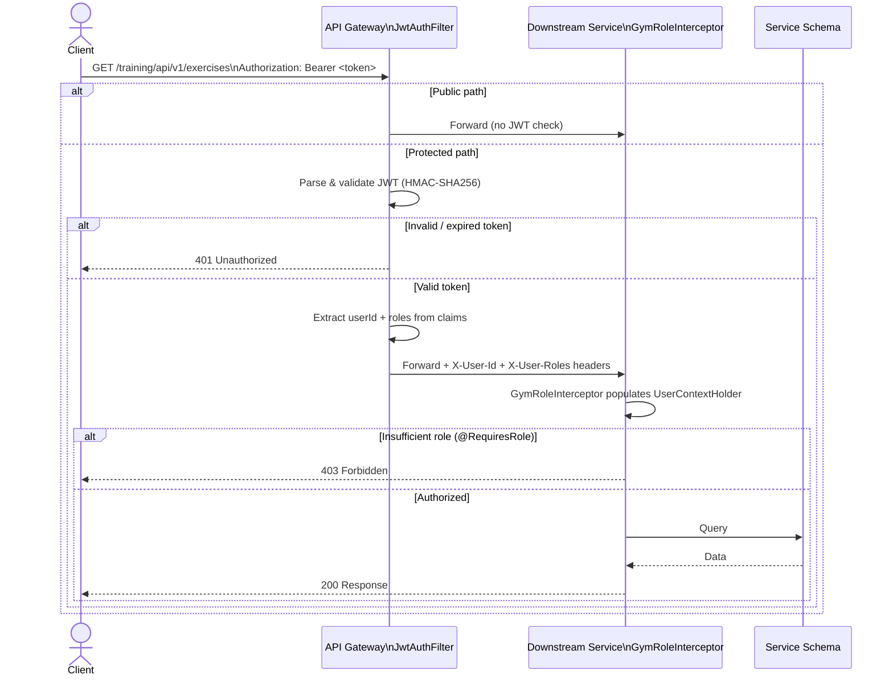
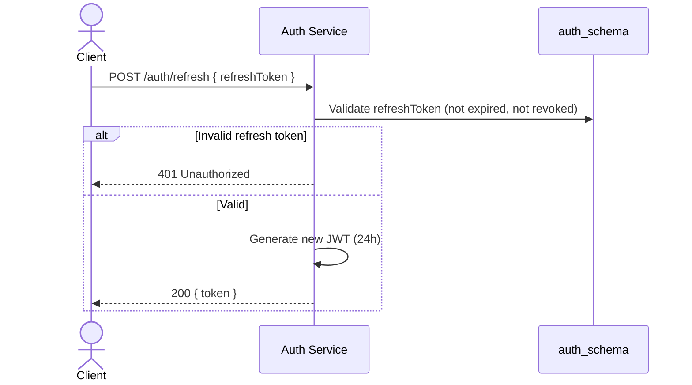
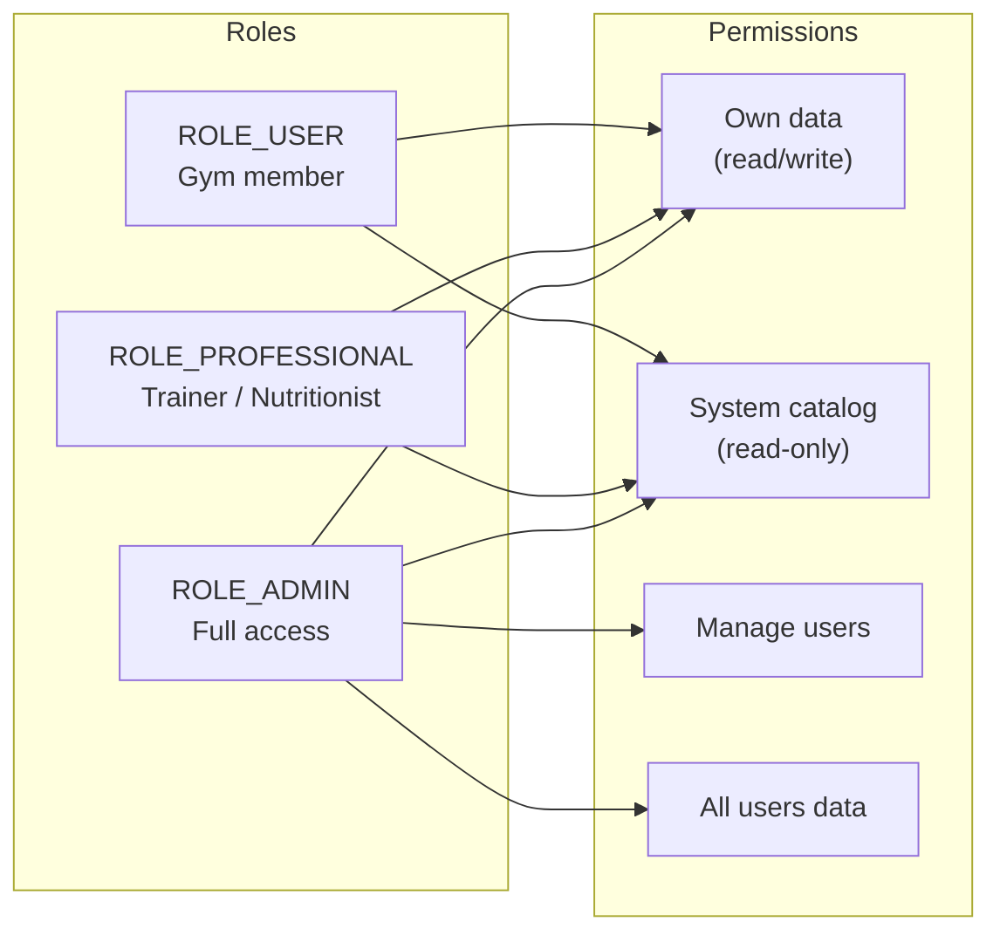

# Authentication & Authorization Flow

## Login Flow

```mermaid
sequenceDiagram
    actor Client
    participant GW as API Gateway
    participant Auth as Auth Service
    participant DB as auth_schema

    Client->>Auth: POST /auth/login { email, password }
    Auth->>DB: SELECT user WHERE email = ?
    DB-->>Auth: user record
    Auth->>Auth: BCrypt.verify(password, hash)
    alt Invalid credentials
        Auth-->>Client: 401 Unauthorized
    else Valid credentials
        Auth->>Auth: Generate JWT (userId, roles, 24h)
        Auth->>Auth: Generate RefreshToken (7d)
        Auth-->>Client: 200 { token, refreshToken, userId, email }
    end
```

## Authenticated Request Flow

```mermaid
sequenceDiagram
    actor Client
    participant GW as API Gateway\nJwtAuthFilter
    participant Svc as Downstream Service\nGymRoleInterceptor
    participant DB as Service Schema

    Client->>GW: GET /training/api/v1/exercises\nAuthorization: Bearer <token>

    alt Public path
        GW->>Svc: Forward (no JWT check)
    else Protected path
        GW->>GW: Parse & validate JWT (HMAC-SHA256)
        alt Invalid / expired token
            GW-->>Client: 401 Unauthorized
        else Valid token
            GW->>GW: Extract userId + roles from claims
            GW->>Svc: Forward + X-User-Id + X-User-Roles headers
            Svc->>Svc: GymRoleInterceptor populates UserContextHolder
            alt Insufficient role (@RequiresRole)
                Svc-->>Client: 403 Forbidden
            else Authorized
                Svc->>DB: Query
                DB-->>Svc: Data
                Svc-->>Client: 200 Response
            end
        end
    end
```

## Token Refresh Flow

```mermaid
sequenceDiagram
    actor Client
    participant Auth as Auth Service
    participant DB as auth_schema

    Client->>Auth: POST /auth/refresh { refreshToken }
    Auth->>DB: Validate refreshToken (not expired, not revoked)
    alt Invalid refresh token
        Auth-->>Client: 401 Unauthorized
    else Valid
        Auth->>Auth: Generate new JWT (24h)
        Auth-->>Client: 200 { token }
    end
```

## RBAC Model

```mermaid
graph LR
    subgraph Roles
        USER["ROLE_USER\nGym member"]
        PROF["ROLE_PROFESSIONAL\nTrainer / Nutritionist"]
        ADMIN["ROLE_ADMIN\nFull access"]
    end

    subgraph Permissions
        OwnData["Own data\n(read/write)"]
        SystemData["System catalog\n(read-only)"]
        ManageUsers["Manage users"]
        AllData["All users data"]
    end

    USER --> OwnData
    USER --> SystemData
    PROF --> OwnData
    PROF --> SystemData
    ADMIN --> OwnData
    ADMIN --> SystemData
    ADMIN --> ManageUsers
    ADMIN --> AllData
```
