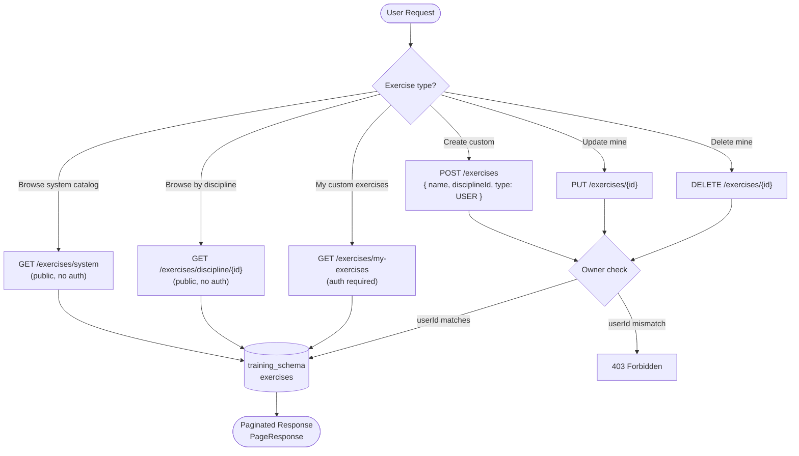
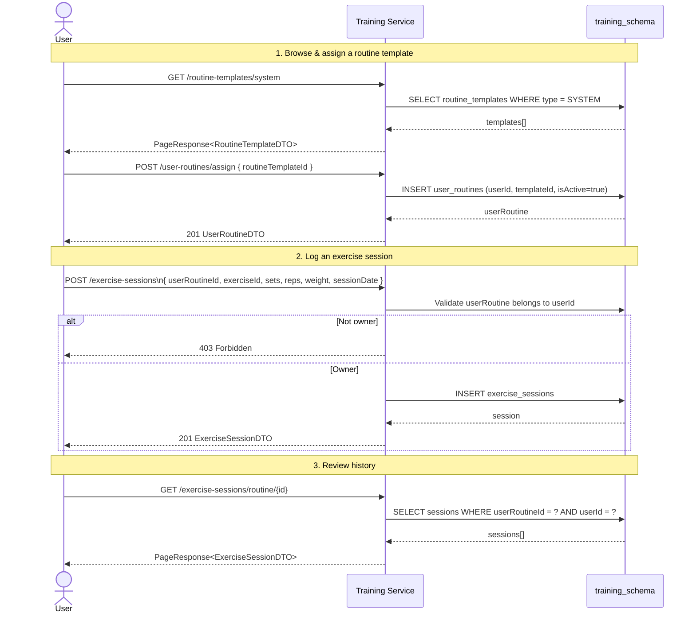
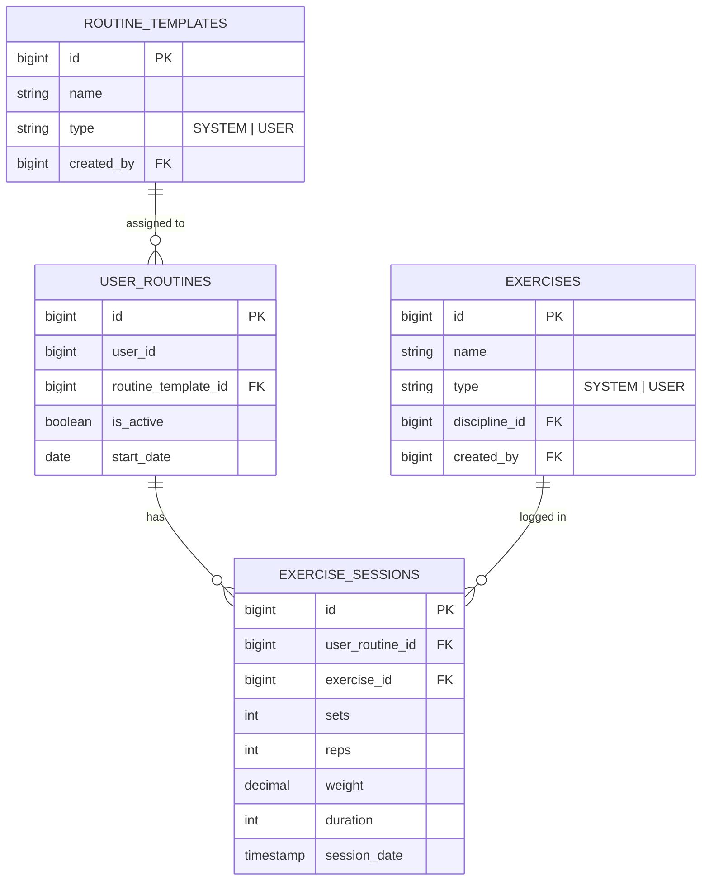

# Training Service Flows

## Exercise Management Flow

```mermaid
flowchart TD
    Start([User Request]) --> Q1{Exercise type?}

    Q1 -->|Browse system catalog| GetSystem["GET /exercises/system\n(public, no auth)"]
    Q1 -->|Browse by discipline| GetDisc["GET /exercises/discipline/{id}\n(public, no auth)"]
    Q1 -->|My custom exercises| GetMine["GET /exercises/my-exercises\n(auth required)"]
    Q1 -->|Create custom| Create["POST /exercises\n{ name, disciplineId, type: USER }"]
    Q1 -->|Update mine| Update["PUT /exercises/{id}"]
    Q1 -->|Delete mine| Delete["DELETE /exercises/{id}"]

    Create --> OwnerCheck{Owner check}
    Update --> OwnerCheck
    Delete --> OwnerCheck

    OwnerCheck -->|userId matches| DB[(training_schema\nexercises)]
    OwnerCheck -->|userId mismatch| Forbidden["403 Forbidden"]

    GetSystem --> DB
    GetDisc --> DB
    GetMine --> DB
    DB --> Response([Paginated Response\nPageResponse])
```

## Routine & Session Flow

```mermaid
sequenceDiagram
    actor User
    participant Training as Training Service
    participant DB as training_schema

    Note over User,DB: 1. Browse & assign a routine template
    User->>Training: GET /routine-templates/system
    Training->>DB: SELECT routine_templates WHERE type = SYSTEM
    DB-->>Training: templates[]
    Training-->>User: PageResponse<RoutineTemplateDTO>

    User->>Training: POST /user-routines/assign { routineTemplateId }
    Training->>DB: INSERT user_routines (userId, templateId, isActive=true)
    DB-->>Training: userRoutine
    Training-->>User: 201 UserRoutineDTO

    Note over User,DB: 2. Log an exercise session
    User->>Training: POST /exercise-sessions\n{ userRoutineId, exerciseId, sets, reps, weight, sessionDate }
    Training->>DB: Validate userRoutine belongs to userId
    alt Not owner
        Training-->>User: 403 Forbidden
    else Owner
        Training->>DB: INSERT exercise_sessions
        DB-->>Training: session
        Training-->>User: 201 ExerciseSessionDTO
    end

    Note over User,DB: 3. Review history
    User->>Training: GET /exercise-sessions/routine/{id}
    Training->>DB: SELECT sessions WHERE userRoutineId = ? AND userId = ?
    DB-->>Training: sessions[]
    Training-->>User: PageResponse<ExerciseSessionDTO>
```

## Data Model

```mermaid
erDiagram
    EXERCISES {
        bigint id PK
        string name
        string type "SYSTEM | USER"
        bigint discipline_id FK
        bigint created_by FK
    }
    ROUTINE_TEMPLATES {
        bigint id PK
        string name
        string type "SYSTEM | USER"
        bigint created_by FK
    }
    USER_ROUTINES {
        bigint id PK
        bigint user_id
        bigint routine_template_id FK
        boolean is_active
        date start_date
    }
    EXERCISE_SESSIONS {
        bigint id PK
        bigint user_routine_id FK
        bigint exercise_id FK
        int sets
        int reps
        decimal weight
        int duration
        timestamp session_date
    }

    ROUTINE_TEMPLATES ||--o{ USER_ROUTINES : "assigned to"
    USER_ROUTINES ||--o{ EXERCISE_SESSIONS : "has"
    EXERCISES ||--o{ EXERCISE_SESSIONS : "logged in"
```
