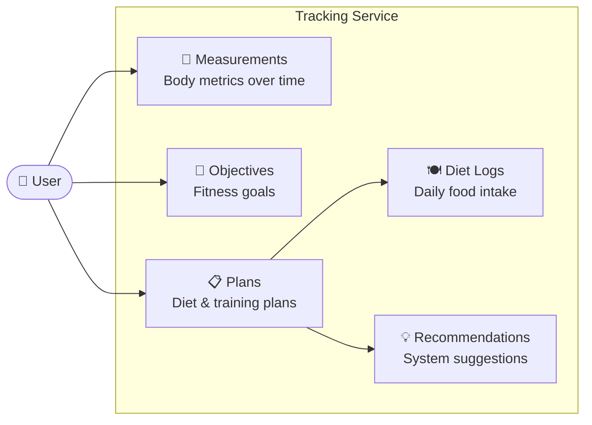
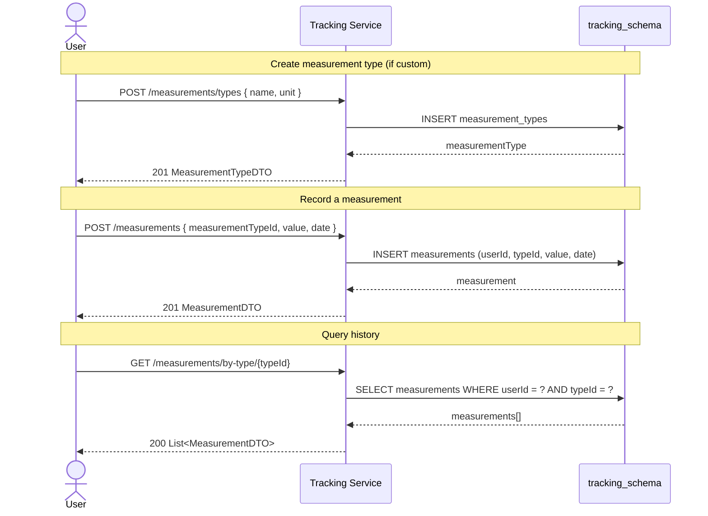
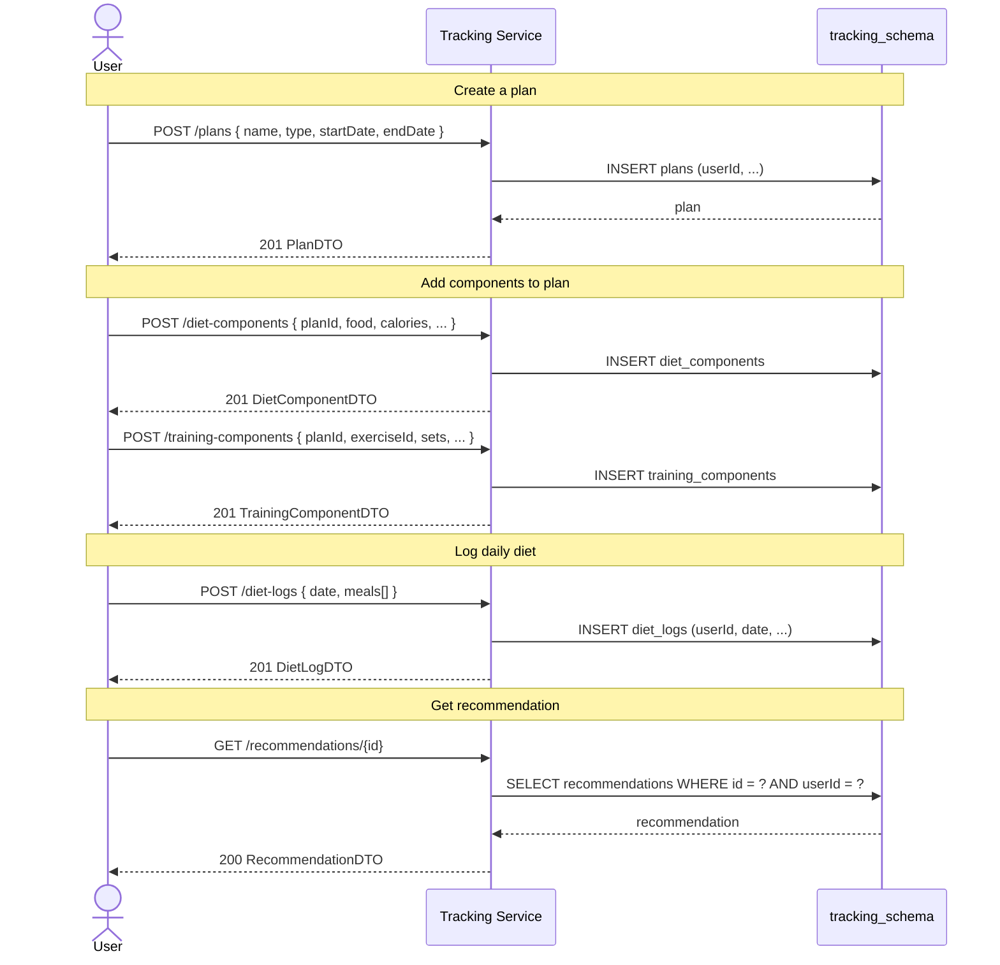
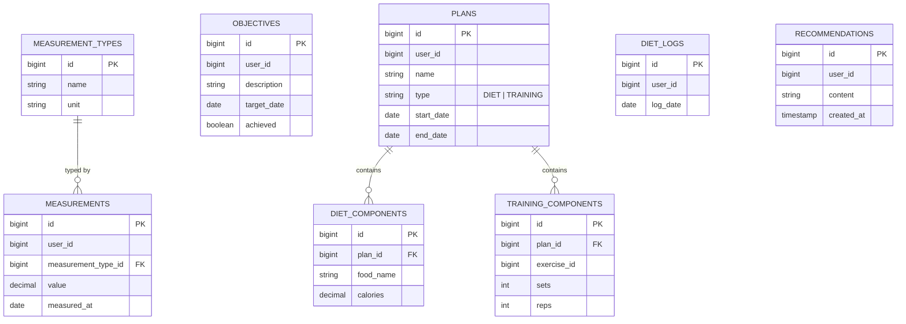

# Tracking Service Flows

## Tracking Overview

```mermaid
flowchart LR
    User(["👤 User"])

    subgraph Tracking["Tracking Service"]
        Measurements["📏 Measurements\nBody metrics over time"]
        Objectives["🎯 Objectives\nFitness goals"]
        Plans["📋 Plans\nDiet & training plans"]
        DietLogs["🍽️ Diet Logs\nDaily food intake"]
        Recommendations["💡 Recommendations\nSystem suggestions"]
    end

    User --> Measurements
    User --> Objectives
    User --> Plans
    Plans --> DietLogs
    Plans --> Recommendations
```

## Measurement Tracking Flow

```mermaid
sequenceDiagram
    actor User
    participant Tracking as Tracking Service
    participant DB as tracking_schema

    Note over User,DB: Create measurement type (if custom)
    User->>Tracking: POST /measurements/types { name, unit }
    Tracking->>DB: INSERT measurement_types
    DB-->>Tracking: measurementType
    Tracking-->>User: 201 MeasurementTypeDTO

    Note over User,DB: Record a measurement
    User->>Tracking: POST /measurements { measurementTypeId, value, date }
    Tracking->>DB: INSERT measurements (userId, typeId, value, date)
    DB-->>Tracking: measurement
    Tracking-->>User: 201 MeasurementDTO

    Note over User,DB: Query history
    User->>Tracking: GET /measurements/by-type/{typeId}
    Tracking->>DB: SELECT measurements WHERE userId = ? AND typeId = ?
    DB-->>Tracking: measurements[]
    Tracking-->>User: 200 List<MeasurementDTO>
```

## Plan & Diet Log Flow

```mermaid
sequenceDiagram
    actor User
    participant Tracking as Tracking Service
    participant DB as tracking_schema

    Note over User,DB: Create a plan
    User->>Tracking: POST /plans { name, type, startDate, endDate }
    Tracking->>DB: INSERT plans (userId, ...)
    DB-->>Tracking: plan
    Tracking-->>User: 201 PlanDTO

    Note over User,DB: Add components to plan
    User->>Tracking: POST /diet-components { planId, food, calories, ... }
    Tracking->>DB: INSERT diet_components
    Tracking-->>User: 201 DietComponentDTO

    User->>Tracking: POST /training-components { planId, exerciseId, sets, ... }
    Tracking->>DB: INSERT training_components
    Tracking-->>User: 201 TrainingComponentDTO

    Note over User,DB: Log daily diet
    User->>Tracking: POST /diet-logs { date, meals[] }
    Tracking->>DB: INSERT diet_logs (userId, date, ...)
    Tracking-->>User: 201 DietLogDTO

    Note over User,DB: Get recommendation
    User->>Tracking: GET /recommendations/{id}
    Tracking->>DB: SELECT recommendations WHERE id = ? AND userId = ?
    DB-->>Tracking: recommendation
    Tracking-->>User: 200 RecommendationDTO
```

## Data Model

```mermaid
erDiagram
    MEASUREMENT_TYPES {
        bigint id PK
        string name
        string unit
    }
    MEASUREMENTS {
        bigint id PK
        bigint user_id
        bigint measurement_type_id FK
        decimal value
        date measured_at
    }
    OBJECTIVES {
        bigint id PK
        bigint user_id
        string description
        date target_date
        boolean achieved
    }
    PLANS {
        bigint id PK
        bigint user_id
        string name
        string type "DIET | TRAINING"
        date start_date
        date end_date
    }
    DIET_COMPONENTS {
        bigint id PK
        bigint plan_id FK
        string food_name
        decimal calories
    }
    TRAINING_COMPONENTS {
        bigint id PK
        bigint plan_id FK
        bigint exercise_id
        int sets
        int reps
    }
    DIET_LOGS {
        bigint id PK
        bigint user_id
        date log_date
    }
    RECOMMENDATIONS {
        bigint id PK
        bigint user_id
        string content
        timestamp created_at
    }

    MEASUREMENT_TYPES ||--o{ MEASUREMENTS : "typed by"
    PLANS ||--o{ DIET_COMPONENTS : "contains"
    PLANS ||--o{ TRAINING_COMPONENTS : "contains"
```
