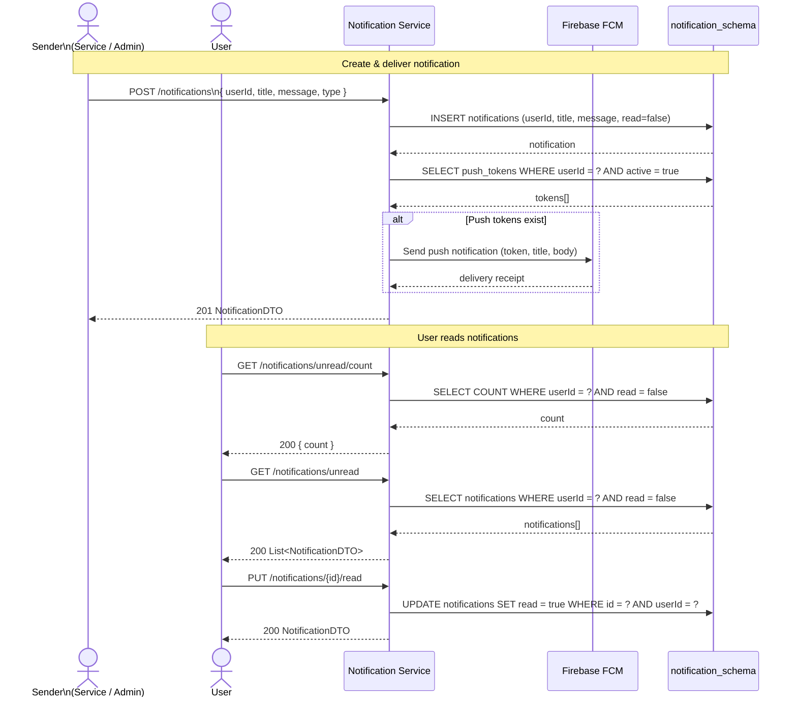
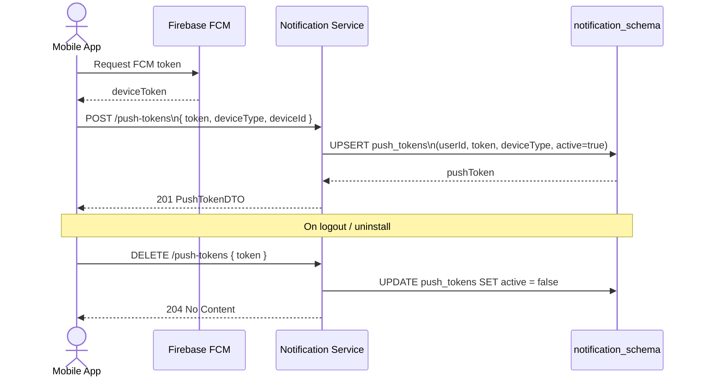
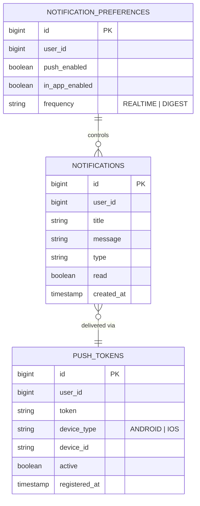

# Notification Service Flows

## Notification Flow

```mermaid
sequenceDiagram
    actor Sender as Sender\n(Service / Admin)
    actor User
    participant Notif as Notification Service
    participant FCM as Firebase FCM
    participant DB as notification_schema

    Note over Sender,DB: Create & deliver notification
    Sender->>Notif: POST /notifications\n{ userId, title, message, type }
    Notif->>DB: INSERT notifications (userId, title, message, read=false)
    DB-->>Notif: notification

    Notif->>DB: SELECT push_tokens WHERE userId = ? AND active = true
    DB-->>Notif: tokens[]

    alt Push tokens exist
        Notif->>FCM: Send push notification (token, title, body)
        FCM-->>Notif: delivery receipt
    end

    Notif-->>Sender: 201 NotificationDTO

    Note over User,DB: User reads notifications
    User->>Notif: GET /notifications/unread/count
    Notif->>DB: SELECT COUNT WHERE userId = ? AND read = false
    DB-->>Notif: count
    Notif-->>User: 200 { count }

    User->>Notif: GET /notifications/unread
    Notif->>DB: SELECT notifications WHERE userId = ? AND read = false
    DB-->>Notif: notifications[]
    Notif-->>User: 200 List<NotificationDTO>

    User->>Notif: PUT /notifications/{id}/read
    Notif->>DB: UPDATE notifications SET read = true WHERE id = ? AND userId = ?
    Notif-->>User: 200 NotificationDTO
```

## Push Token Registration Flow

```mermaid
sequenceDiagram
    actor App as Mobile App
    participant FCM as Firebase FCM
    participant Notif as Notification Service
    participant DB as notification_schema

    App->>FCM: Request FCM token
    FCM-->>App: deviceToken

    App->>Notif: POST /push-tokens\n{ token, deviceType, deviceId }
    Notif->>DB: UPSERT push_tokens\n(userId, token, deviceType, active=true)
    DB-->>Notif: pushToken
    Notif-->>App: 201 PushTokenDTO

    Note over App,DB: On logout / uninstall
    App->>Notif: DELETE /push-tokens { token }
    Notif->>DB: UPDATE push_tokens SET active = false
    Notif-->>App: 204 No Content
```

## Data Model

```mermaid
erDiagram
    NOTIFICATIONS {
        bigint id PK
        bigint user_id
        string title
        string message
        string type
        boolean read
        timestamp created_at
    }
    PUSH_TOKENS {
        bigint id PK
        bigint user_id
        string token
        string device_type "ANDROID | IOS"
        string device_id
        boolean active
        timestamp registered_at
    }
    NOTIFICATION_PREFERENCES {
        bigint id PK
        bigint user_id
        boolean push_enabled
        boolean in_app_enabled
        string frequency "REALTIME | DIGEST"
    }

    NOTIFICATIONS }o--|| PUSH_TOKENS : "delivered via"
    NOTIFICATION_PREFERENCES ||--o{ NOTIFICATIONS : "controls"
```
